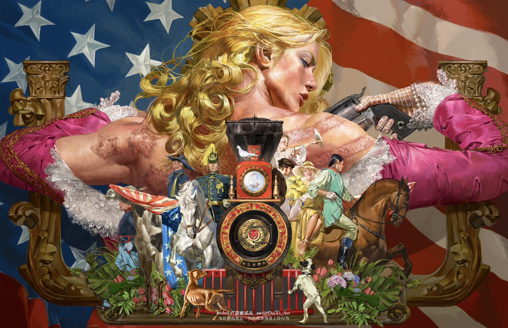

# Graph-A-Thon
<figure>
    <div style="text-align: center;">
        
        <figcaption>Artwork by @DaiYi_Art</figcaption>
    </div>
</figure>

## Introduction
Welcome to ACM SIGGRAPH @ UNLV's first Graph-A-Thon of DOOM!!! This event's goal is to discover the truth and power behind spin. In order to help Johnny Joestar we need to implement a proper inverse rendering application to understand the properties of the steel balls and even their geometry!

The current application is missing valuable information in regards to NEE Path Tracing, GGX Microfacet BRDF, Multi-view optimization, and Geometry Optimization! Can you figure out how to piece it all together and unlock... GOLDEN SPIN!

We will implement a fully (hopefully) functioning GPU-accelerated inverse rendering system built on [Taichi Lang](https://www.taichi-lang.org/). Given target images (synthetic renders), it recovers material properties and geometry by differentiating through a physically-based Monte Carlo path tracer to uncover Gyro Zeppeli's secrets.

## Resources
To provide you guidance in this race there are three other documents you should become familiar with after finishing this document:

- [SETUP](./SETUP.md)                     Information to get your programming environment setup
- [JOURNEY](./JOURNEY.md)               Specification of the tasks to complete
- [RESOURCES](./RESOURCES.md)              Reference information to help solve or understand tasks and code


## Features

- **NEE path tracing** — next event estimation with direct light sampling reduces variance dramatically over pure path tracing
- **GGX microfacet BRDF** — Cook-Torrance specular + energy-conserving Lambert diffuse, with per-material albedo, roughness, and metallic parameters
- **Multi-view optimization** — simultaneous optimization against multiple camera viewpoints for better-constrained material recovery
- **Geometry optimization** — sphere position and radius recovery via SPSA (simultaneous perturbation stochastic approximation) + Adam optimizer
- **Real-time GGUI visualization** — live side-by-side target vs. current rendering with ImGui parameter panels
- **JSON scene format** — define scenes declaratively, swap them without code changes

## Requirements

- Python 3.13+
- [Taichi](https://docs.taichi-lang.org/) 1.7+
- NumPy
- Matplotlib

```bash
uv sync
```

## Quick Start

```bash
# Optimize materials for the Cornell box scene
uv run train.py --scene scenes/cornellbox.json

# Headless mode (no GUI window)
uv run train.py --scene scenes/cornellbox.json --no-gui

# Also optimize sphere positions and radii
uv run train.py --scene scenes/cornellbox.json --optimize-geometry

# Use a different scene
uv run train.py --scene scenes/materialgallery.json

# List available scenes
uv run train.py --list-scenes
```

## Using Pre-rendered Images

### Pre-render synthetic targets (run once, then iterate fast)

```bash
# Render ground truth at high SPP 
uv run render_targets.py --scene scenes/cornellbox.json --spp 128

# Train against the pre-rendered targets 
uv run train.py --scene scenes/cornellbox.json --load-targets targets/cornellbox
```

## GGUI Controls

| Key | Action |
|-----|--------|
| `SPACE` | Pause / resume optimization |
| `V` | Cycle through camera views |
| `R` | Reset all parameters to initial guess |
| `ESC` | Quit |

The window shows target (left) and current optimized render (right) side by side. The ImGui panel displays loss, material parameters, and geometry state in real time.

## Project Structure

```
train.py                  Entry point — CLI, optimization loop, GUI
render_targets.py         Standalone target renderer (run once offline)
plot_loss.py              Standalone visualization tool of loss history
diffpt/
  config.py               Constants: max capacities, defaults
  fields.py               All Taichi field allocation (single source of truth)
  kernels.py              All @ti.func and @ti.kernel (single compilation unit)
  scene_loader.py         JSON scene file parser (pure Python)
  geo_optimizer.py        SPSA + Adam geometry optimization
scenes/
  cornellbox.json         Classic Cornell box with GGX spheres
  materialgallery.json    3 spheres: chrome, ceramic, rubber
  singlesphere.json       Minimal single-sphere scene
  goldenspin.json         Final Challenge!
output/                   Generated during training (images, loss curves)
targets/                  Pre-rendered or captured target images
```

### Why `kernels.py` contains all Taichi code

Taichi `@ti.func` functions are force-inlined at compile time. In Taichi 1.7.x, importing `@ti.func` across Python module boundaries is unreliable. Keeping all Taichi-compiled code in a single file (`kernels.py`) avoids this while still allowing clean separation of pure Python logic (scene loading, image I/O, optimization orchestration) into their own modules.

## Scene Format

Scenes are JSON files defining geometry, materials, cameras, and optimization settings. Materials are referenced by name:

```json
{
  "name": "My Scene",
  "settings": { "img_w": 256, "img_h": 256, "spp": 8, "num_iters": 500 },
  "cameras": [
    { "position": [0, 1, 3], "target": [0, 1, 0] }
  ],
  "materials": {
    "floor":  { "albedo": [0.8, 0.8, 0.8], "roughness": 0.7, "metallic": 0.0 },
    "sphere": { "albedo": [0.9, 0.2, 0.1], "roughness": 0.2, "metallic": 0.8 }
  },
  "emission": [18.0, 18.0, 18.0],
  "quads": [
    {
      "center": [0, 0, 0], "u": [1, 0, 0], "v": [0, 0, 1],
      "normal": [0, 1, 0], "material": "floor", "is_light": false
    }
  ],
  "spheres": [
    { "center": [0, 0.5, 0], "radius": 0.5, "material": "sphere" }
  ],
  "initial_guess": {
    "materials": { "albedo_default": [0.5, 0.5, 0.5], "roughness_default": 0.5, "metallic_default": 0.3 },
    "emission": [10.0, 10.0, 10.0]
  },
  "initial_guess_geometry": {
    "spheres": [ { "center": [0.2, 0.6, 0.1], "radius": 0.35 } ]
  }
}
```

Scene limits (compile-time, changeable in `config.py`): 16 quads, 8 spheres, 16 materials, 8 camera views.

## How It Works

### Rendering

The path tracer uses next event estimation (NEE): at each surface hit, it samples a point on the area light, traces a shadow ray for visibility, evaluates the GGX BRDF for the light direction, and adds the direct illumination. The path continues via cosine-weighted hemisphere sampling with Russian roulette termination after bounce 2.

### Material Gradients

For albedo and emission, the gradient is computed analytically using the ratio trick. Since radiance is approximately proportional to the product of albedos along a path:

```
∂(radiance_c) / ∂(albedo[m]_c) ≈ radiance_c / albedo[m]_c
```

This is computed in a single fused render pass where each sample's radiance and bounce materials are stored in registers, and gradients are accumulated after the pixel color is known. No double-tracing.

Roughness and metallic gradients use SPSA (simultaneous perturbation): perturb all parameters with random ±1 signs, render twice, estimate the full gradient from the loss difference. Cost: 2 renders total regardless of parameter count.

### Geometry Gradients

Sphere positions and radii are optimized via SPSA with an Adam optimizer. The perturbation magnitude decays over training for fine convergence. Interior shading gradients can also be computed analytically from the intersection derivative `dt/dc`, but SPSA handles the critical silhouette discontinuities that analytical methods cannot.

### Multi-View

The loss is summed across all camera views, and gradients accumulate from each view. Multiple viewpoints constrain the optimization — a single view can confuse material color with lighting effects, but several views triangulate the true material properties.

## Notes for Graphics Programmers

If you're coming from Vulkan/GLSL/HLSL:

| This project | Vulkan equivalent |
|---|---|
| `trace_sample_nee()` | Raygen shader + closest-hit + any-hit |
| `eval_brdf()` | PBR fragment shader (same GGX math) |
| `albedo` / `roughness` / `metallic` fields | Material UBO or push constants |
| `scene_intersect()` | `traceRayEXT()` in RT pipeline |
| `rng_seed` field | Per-invocation state (push constant or descriptor binding) |
| Taichi `@ti.kernel` | `vkCmdDispatch` (compute shader launch) |
| `render_and_grad_kernel` | No equivalent — this is the differentiable part |

The fundamental addition over a standard renderer is that every floating-point operation contributes to gradient computation. The optimizer adjusts material parameters to minimize the L2 pixel error between the rendered image and the target, using the gradients to determine which direction to move each parameter.

## CLI Reference

### `train.py`

| Flag | Description |
|------|-------------|
| `--scene PATH` | Scene JSON file (required) |
| `--load-targets DIR` | Load target images from directory instead of rendering |
| `--optimize-geometry` | Enable sphere position/radius optimization |
| `--no-gui` | Run headless, output to `output/` directory |
| `--list-scenes` | List available scene files and exit |

### `render_targets.py`

| Flag | Description |
|------|-------------|
| `--scene PATH` | Scene JSON file (required) |
| `--spp N` | Samples per pixel (default: 64, higher = cleaner) |
| `--output DIR` | Output directory (default: `targets/<scene_name>`) |

## Output

Training produces files in `output/`:

| File | Description |
|------|-------------|
| `target_v{N}.ppm` | Ground truth target images |
| `iter_{NNNN}_v{N}.ppm` | Intermediate results every 50 iterations |
| `final_v{N}.ppm` | Final optimized renders |
| `loss_history.npy` | Loss value per iteration (numpy array) |

## License

This project is provided as-is for educational and research purposes.

## Acknowledgments

Inspired by the architecture of [Mitsuba 3](https://mitsuba.readthedocs.io/) and its differentiable rendering pipeline. The path-replay backpropagation strategy, where the forward pass records path structure and the backward pass replays only the differentiable shading, is adapted from the PRB integrator described in Vicini et al. 2021.
